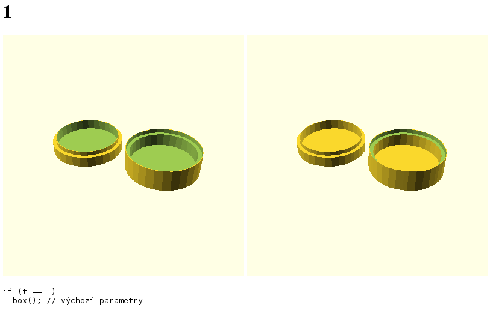

box-task
========

Tests for BI-3DT homework.

Information for students
------------------------

To run the tests on your code, put your `box.scad` in `students/username/box.scad` and proceed with **Running the tests** section.

Adding test cases
-----------------

To add a test case, open `tests.scad` and add a new test to the end of the file, before the comments section:

    if (t == X) {
      // your test here
    }

Where `X` is the number of the test and must be `last_number_used+1`, otherwise the test suite breaks.

To be able to see your code, you can do one of the following:

 * Code your test without the `if` statement and surround it by `if` after you are satisfied.
 * Add `t = X;` somewhere outside of `if` statement (i.e. to the global scope), don't forget to remove it before commiting.

**Never manipulate the 3D view by mouse** (zoom, shift, rotate), only manipulate the view by OpenSCAD code:

    if (t == X) {
      translate(...)
        rotate(...)
          box(...);
    }

If you happen to manipulate the view by accident, you can select **Reset view** from the **View** menu.

For your convenience, the module `cut()` is provided, that let you see the slice of an object. See some tests that use it, to see how it works:

    if (t == 8)
      cut()
        box(to_print=false,reserve=0,$fn=100);

The cut is done by XZ plane, and is translated to the view. Also notice that you can and shall use `$fn` when necessary - for example to avoid different results depending on the initial position of a corner circle/cylinder.

When adding new test, check if *our* `box.scad` works as expected!

Downloading from Edux
---------------------

You'll need two files: `usernames.txt` and `cookie.txt`. The first lists usernames of our students (see `usernames.txt.sample` for syntax). The second one adds exactly one cookie from Edux (it's the longest one) - see `cookie.txt.sample` for syntax.

For security reasons, those files are not stored in git and are gitignored.

When ready, run `./download.sh` to download stuff from Edux.

Running the tests
-----------------

Once downloaded the solutions form Edux or once put your solution to the right folder, run `./runtests.sh` to run the tests. For each student, the jobs run in parallel. Your CPUs might get a bit hot.

Examining the results
---------------------

To see the result, use your web browser to view `index.html` (located in each student's folder).

I do this:

    favorite-webbrowser students/*/index.html

Tested box is on the right:

**Notes:** Some images are missing from the HTML report, that's because no geometry was present. Sometimes empty image is shown. Consider no image and empty image the same. Also note the colors do not take any significant role in the results.

In case all of the geometry is extremely zoomed in (it happens on some platforms), open `runtests.sh` and edit the last constant of the `--camera` option passed to `openscad` to, let's say 430, and rerun the tests.
